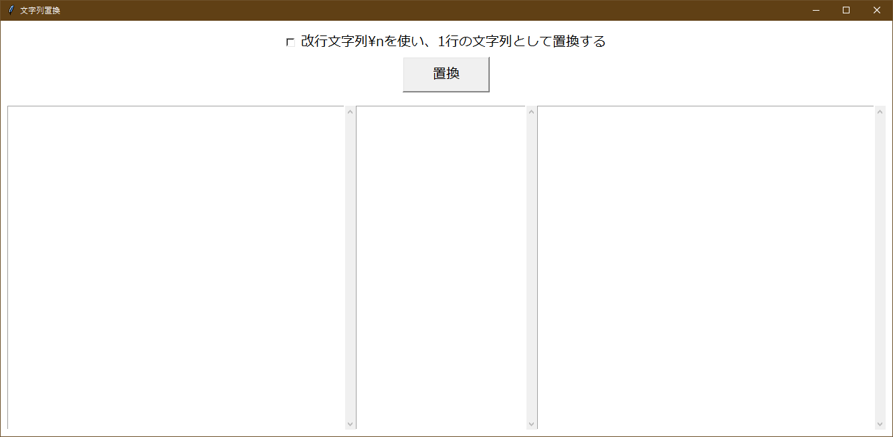

# ReplaceString

**ReplaceString**は単純な文字列置換GUIアプリケーションです。



## 使い方

1. 左側のテキストボックスに置換前のテキストを入れます。
1. 真ん中のテキストボックスに置換ルール（後述）を記載します。
1. 置換ボタンを押します。

## 置換ルール

置換するためのルールは以下のように記載します。

```text
置換前の文字列1 -> 置換後の文字列1
置換前の文字列2 -> 置換後の文字列2
...
```

置換前の文字列と置換後の文字列は` -> `（半角スペース + ハイフン + 不等号 + 半角スペース）で区切ります。

### 1行の文字列として置換する

デフォルトでは置換は各行に対して行われます。

| 置換前 | 置換ルール | 置換後 |
| ----  | ----     | ----  |
| hogehoge<br>hugahuga | ^h -> H<br>o -> O | HOgehOge<br>Hugahuga |

`改行文字列\nを使い、1行の文字列として置換する`にチェックを入れた場合、以下のようになります。

| 置換前 | 置換ルール | 置換後 |
| ----  | ----     | ----  |
| hogehoge<br>hugahuga | ^h -> H<br>o -> O | HOgehOge<br>hugahuga |

これは置換前の文字列を`hogehoge\nhugahuga`として扱うためです。  
`^`は先頭を意味するため、最初の`h`のみが`H`となります。

## ロードマップ

TODO